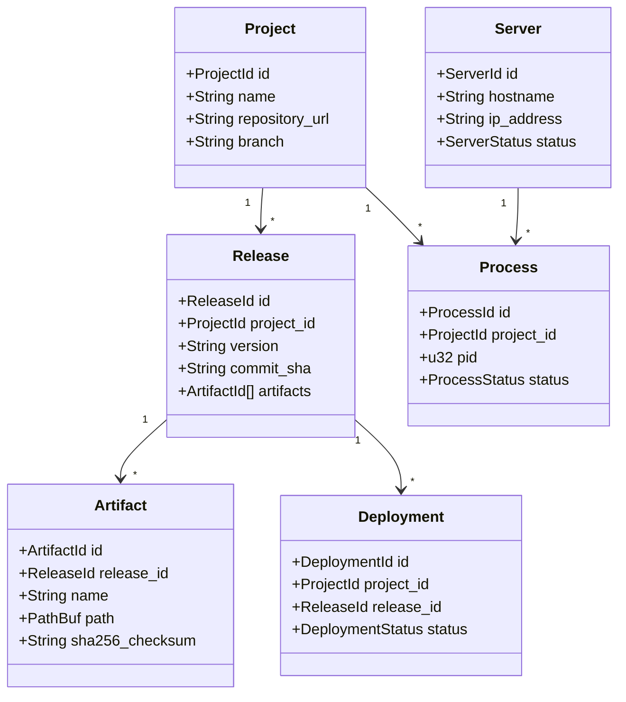

# Domain Model Specification

This document defines the core domain models, value objects, and lifecycle states for the Aegis platform.

---

## 1. Domain Entities & Value Objects

Every entity is identified by a strongly-typed, time-sortable `UUIDv7` wrapper to guarantee type-safety at the compiler level and temporal ordering at the query level.



### 1.1 Project
A Project is the logical namespace grouping code, releases, processes, and configurations.
* **Fields**:
  * `id`: `ProjectId` (UUIDv7)
  * `name`: `String` (Unique alphanumeric identifier)
  * `repository_url`: `String` (VCS remote location)
  * `branch`: `String` (Git tracking branch, e.g., `main`)
  * `config_path`: `PathBuf` (Location of the workspace file)
  * `created_at`: `DateTime<Utc>`
* **Lifecycle**: `Created` → `Active` → `Deactivated` → `Archived`

### 1.2 Release
A Release is an immutable, compile-time snapshot of a Project built from a specific Git commit. It holds references to build artifacts and metadata.
* **Fields**:
  * `id`: `ReleaseId` (UUIDv7)
  * `project_id`: `ProjectId`
  * `version`: `String` (Semantic version tag or timestamp-hash)
  * `commit_sha`: `String` (40-char SHA-1 hash)
  * `commit_message`: `String`
  * `author`: `String` (Committer name and email)
  * `artifacts`: `Vec<ArtifactId>` (Build outputs)
  * `checksums`: `HashMap<String, String>` (Artifact paths to SHA-256 hashes)
  * `environment`: `HashMap<String, String>` (Build-time env variables)
  * `build_duration_ms`: `u64`
  * `created_at`: `DateTime<Utc>`
* **Lifecycle**: `Building` → `Built` | `Failed`

### 1.3 Artifact
An Artifact is an immutable build output file (such as a tarball, binary, or configuration group) generated during the build pipeline.
* **Fields**:
  * `id`: `ArtifactId` (UUIDv7)
  * `release_id`: `ReleaseId`
  * `name`: `String` (e.g., `dist.tar.gz`)
  * `path`: `PathBuf` (Storage location in the Artifact Store)
  * `sha256_checksum`: `String` (Hex checksum for integrity checks)
  * `size_bytes`: `u64`
  * `created_at`: `DateTime<Utc>`

### 1.4 Deployment
A Deployment represents the execution of an orchestration strategy to promote a `Release` onto a target server.
* **Fields**:
  * `id`: `DeploymentId` (UUIDv7)
  * `project_id`: `ProjectId`
  * `release_id`: `ReleaseId`
  * `strategy`: `String` (Immediate, Rolling, BlueGreen, Canary)
  * `status`: `DeploymentStatus` (Queued, Building, Testing, Promoting, Active, RolledBack, Failed)
  * `created_at`: `DateTime<Utc>`
  * `completed_at`: `Option<DateTime<Utc>>`

### 1.5 Server
A Server represents a host machine (local VPS or cluster node) running a daemon instance.
* **Fields**:
  * `id`: `ServerId` (UUIDv7)
  * `hostname`: `String`
  * `ip_address`: `String`
  * `status`: `ServerStatus` (Online, Degraded, Offline)
  * `tags`: `HashMap<String, String>`
  * `last_heartbeat`: `DateTime<Utc>`

### 1.6 Process
A Process represents a running system command instance monitored by the daemon.
* **Fields**:
  * `id`: `ProcessId` (UUIDv7)
  * `project_id`: `ProjectId`
  * `pid`: `u32` (OS Process ID)
  * `status`: `ProcessStatus` (Running, Stopped, Errored)
  * `restart_count`: `u32`
  * `last_start`: `DateTime<Utc>`

---

## 2. Event Sourcing & CQRS Flow

Every mutation is captured as an immutable event published to the `EventBus` and appended to the `EventStore`. Subsystems monitor these events to generate state caches (CQRS-lite).

```
[ Command (CLI/TUI) ]
         │
         ▼
    [ Daemon ]
         │
         ▼
[ Domain Mutation ] ──(Emits Event)──► [ EventBus ] ──(Pub/Sub)──► [ Projection Engine ]
                                            │                            │
                                            ▼                            ▼
                                      [ EventStore ]            [ In-Memory Projections ]
                                      (SQLite DB)               (TUI/CLI Read-Path)
```

---

## 3. Build Pipeline Stage Model

Deployments execute a series of composable, sequential stages. If any stage fails, a rollback is triggered.

```
[ Clone ] ──► [ Install ] ──► [ Build ] ──► [ Test ] ──► [ Package ] ──► [ Verify ] ──► [ Promote ]
```

1. **Clone**: Pulls commit source files from repository configuration.
2. **Install**: Installs third-party runtime package dependencies.
3. **Build**: Compiles source code or bundles files.
4. **Test**: Runs the validation suite.
5. **Package**: Tarballs build directories and stores them in the `ArtifactStore`.
6. **Verify**: Asserts that artifact checksum matches.
7. **Promote**: Switches traffic / restarts services to activate the new Release.
