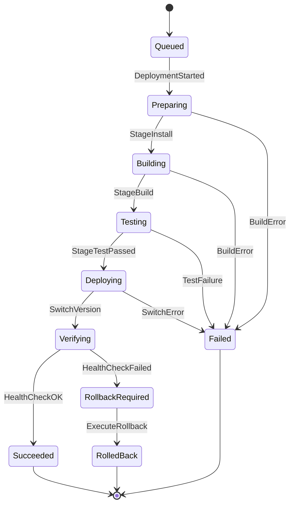
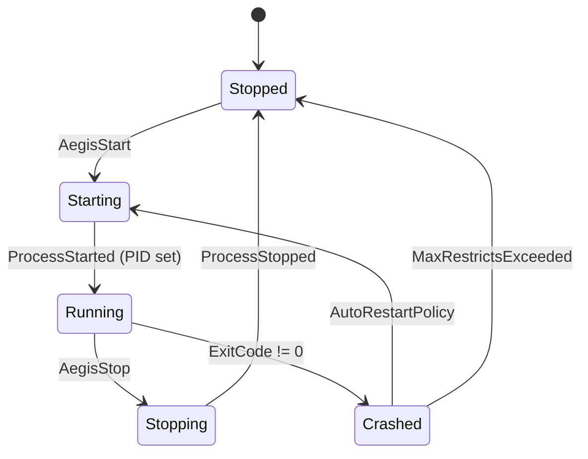
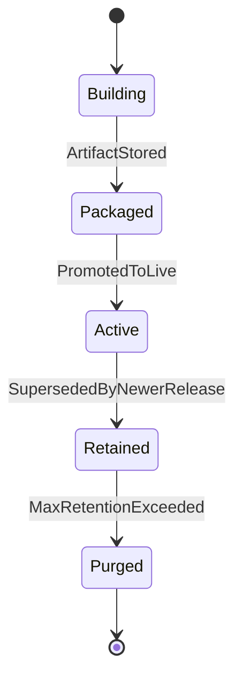
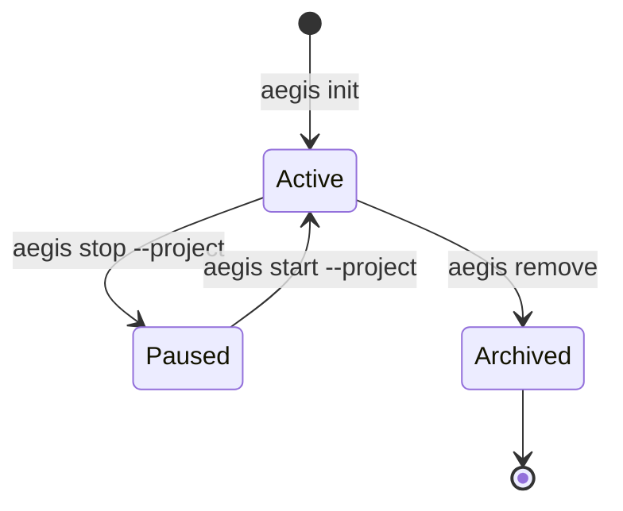

# Aegis Domain State Machines & Lifecycle Specification

This document formalizes state transitions, valid triggers, and terminal states for Aegis core aggregates: **Project**, **Deployment**, **Release**, **Process**, and **Server**.

---

## 1. Deployment State Machine

### Lifecycle Diagram

### Transition Table

| Current State | Target State | Trigger Event | Guard / Precondition |
| :--- | :--- | :--- | :--- |
| `None` | `Queued` | `DeploymentQueued` | Valid `ProjectId` & Git branch. |
| `Queued` | `Preparing` | `DeploymentStarted` | Daemon worker available. |
| `Preparing` | `Building` | `BuildStageInstall` | Runtime dependencies resolved. |
| `Building` | `Testing` | `BuildStageBuild` | Compilation clean exit code 0. |
| `Testing` | `Deploying` | `BuildStageTest` | Test suite passed. |
| `Deploying` | `Verifying` | `ReleasePromoted` | Isolated folder symlinked / switched. |
| `Verifying` | `Succeeded` | `DeploymentSucceeded` | Health check endpoint returning HTTP 200 / TCP UP. |
| `Verifying` | `RollbackRequired`| `DeploymentFailed` | Health check failed or timed out. |
| `RollbackRequired`| `RolledBack` | `DeploymentRolledBack` | Previous active version directory restored. |

---

## 2. Process State Machine

### Transition Rules
* **Max Restarts**: Default 5 consecutive crashes within 60 seconds triggers `Stopped` state with alert event (`ProcessFailedPermanent`).
* **Graceful Timeout**: Default 10-second SIGTERM window before escalating to SIGKILL.

---

## 3. Release State Machine

---

## 4. Project State Machine

